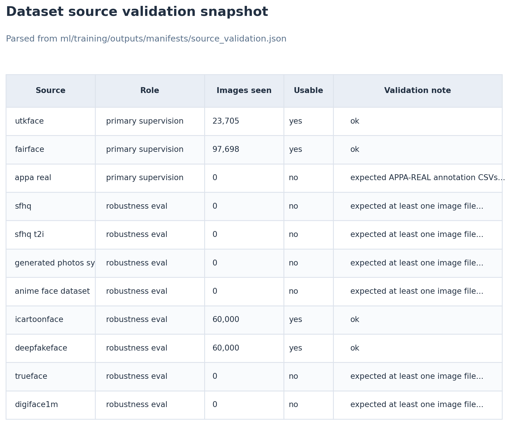
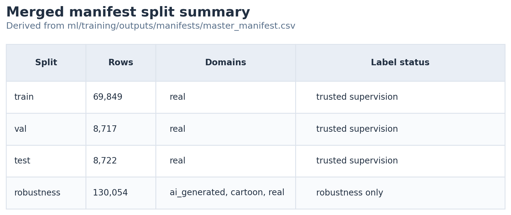
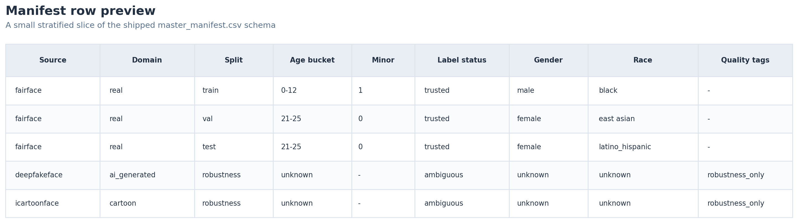
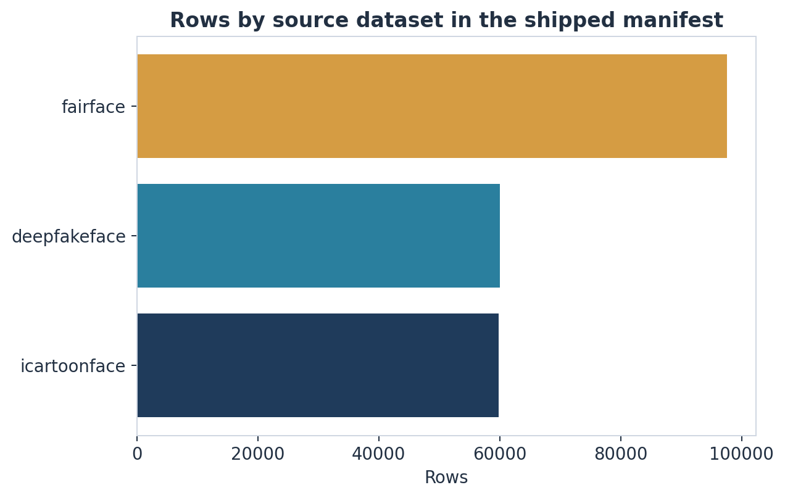
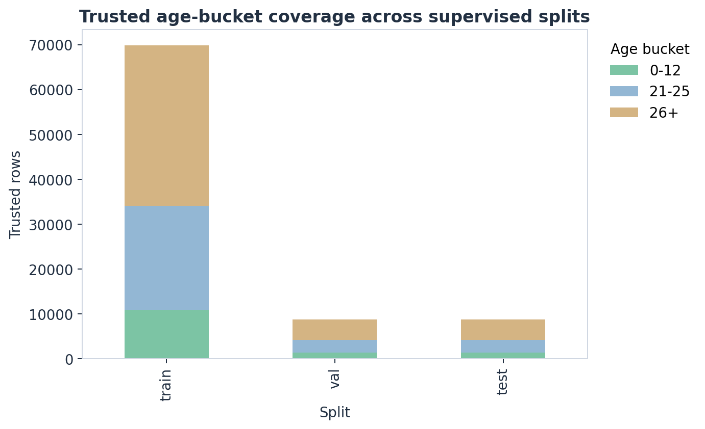
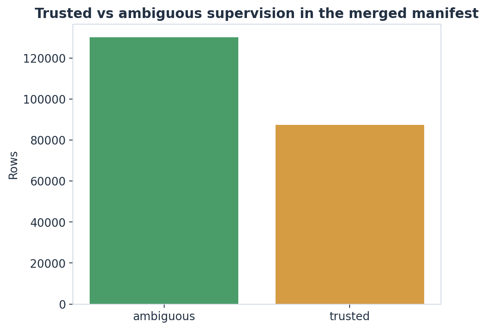
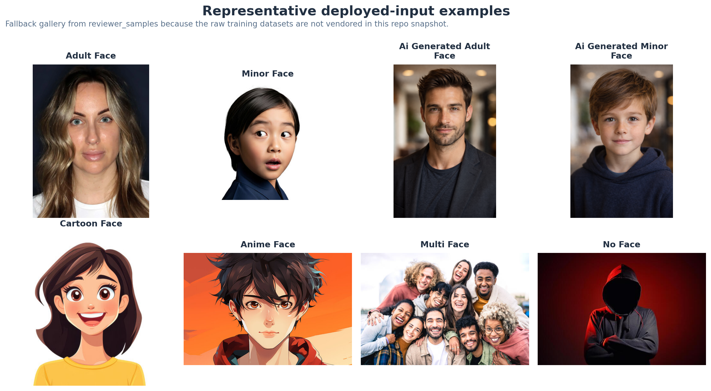

# Data Card

## Purpose

This dataset supports a conservative age-safety pipeline that tries to minimize dangerous false negatives for minors. The dataset is designed for model development, calibration, robustness evaluation, and failure analysis.

## Intended use

- age-safety triage for user-submitted profile photos
- batch screening of image sets before downstream training or publishing
- robustness evaluation under domain shift

## Not intended use

- legal age verification
- identity verification
- biometric identification
- fully automated moderation without human review policy for ambiguous cases

## Dataset hypothesis

The highest-risk false negatives are expected to concentrate in these slices:

- visually ambiguous ages `16-21`
- low-resolution or blurry images
- partially occluded faces
- extreme pose or profile views
- multi-face scenes
- synthetic, stylized, edited, cartoon, anime, or 3D-rendered faces

## Repository-supported data sources

Shipped supervised source:

- [`FairFace`](https://github.com/joojs/fairface)

Evaluated ablation only:

- [`UTKFace`](https://susanqq.github.io/UTKFace/)

Scaffolded but not used in the shipped checkpoint:

- [`APPA-REAL`](https://chalearnlap.cvc.uab.cat/dataset/26/description/)

## Shipped checkpoint data usage

The final shipped checkpoint in this repository was trained on the `FairFace` baseline only.

Additional dataset work in this repo should be read as:

- [`UTKFace`](https://susanqq.github.io/UTKFace/): implemented and evaluated as an ablation, but rejected as the final checkpoint because it reduced minor recall in the `13-17` slice
- [`APPA-REAL`](https://chalearnlap.cvc.uab.cat/dataset/26/description/): planned and scaffolded, but not part of the shipped checkpoint
- non-real datasets: used for robustness evaluation and abstention analysis, not for the main supervised age labels in the shipped model

## Robustness-only or scaffolded non-real sources

Used in the shipped robustness report:

- [`DeepFakeFace`](https://github.com/OpenRL-Lab/DeepFakeFace)
- [`iCartoonFace`](https://github.com/luxiangju-PersonAI/iCartoonFace)

Scaffolded for future robustness expansion:

- [`SFHQ`](https://github.com/SelfishGene/SFHQ-dataset)
- [`SFHQ-T2I`](https://github.com/SelfishGene/SFHQ-T2I-dataset)
- [`Generated Photos Synthetic Face Images Academic Dataset`](https://huggingface.co/datasets/GeneratedPhotos/Synthetic_Face_Images_Academic_Dataset)
- [`Anime Face Dataset`](https://github.com/bchao1/Anime-Face-Dataset)
- [`DigiFace-1M`](https://microsoft.github.io/DigiFace1M/)
- `TrueFace`, subject to access and license review

## Shipped data snapshot

The artifacts in this repo are strong enough to show the dataset composition directly rather than only describing it.

| Source | Evidence in the repo | Domain | Shipped role |
| --- | ---: | --- | --- |
| FairFace | 97,537 rows in `master_manifest.csv` | `real` | trusted supervision, validation, test, and real-photo robustness reference |
| DeepFakeFace | 60,000 rows in `master_manifest.csv` | `ai_generated` | robustness-only evaluation |
| iCartoonFace | 59,805 rows in `master_manifest.csv` | `cartoon` | robustness-only evaluation |
| UTKFace | 23,705 images in `source_validation.json` | `real` | available for ablation, but not used in the shipped manifest |

The validation table below is parsed from [ml/training/outputs/manifests/source_validation.json](ml/training/outputs/manifests/source_validation.json). It is useful because it separates "the code knows about this source" from "this source was actually present and usable in the run that generated the shipped reports."

The split summary below is derived from [ml/training/outputs/manifests/master_manifest.csv](ml/training/outputs/manifests/master_manifest.csv). It shows the most important structural property of the dataset: the supervised splits are real-photo only, while the large robustness partition is a separate evaluation target rather than silent training data.

The manifest preview is a compact example of what a row really looks like after preparation, deduplication, and splitting. Seeing the schema this way makes it clear that provenance, domain, label status, and demographics are all carried together into evaluation and failure analysis.

This count chart makes the source mix legible at a glance. `FairFace` supplies the trusted supervision. `DeepFakeFace` and `iCartoonFace` expand the robustness surface, but they are intentionally kept out of exact-age supervision.

The age-bucket chart shows why the shipped system has to be conservative near the legal boundary. Trusted supervision in the exported manifest is strongest for `0-12`, `21-25`, and `26+`, while the sensitive teenage buckets are not over-claimed as clean labels in the final shipped run.

The label-status chart is the clearest visual summary of that choice. A large portion of the merged manifest is deliberately marked ambiguous or robustness-only, which is exactly what keeps the supervised story honest.

The repo does not redistribute the raw training images, so the gallery below uses tracked reviewer samples as representative examples of the same deployed input regimes. When `data/raw` exists locally, [scripts/generate_report_visuals.py](scripts/generate_report_visuals.py) will automatically replace this gallery with real dataset samples.

## Provenance and licensing

Each source must be documented in the generated source manifest with:

- source dataset name
- original URL
- local acquisition path
- license summary
- manual restrictions or attribution notes

Rows without clear provenance or license context should be excluded from the trusted training set.

## Annotation schema

### Image-level fields

- `image_id`
- `source_dataset`
- `license_type`
- `domain_type`
- `num_faces`
- `has_detectable_face`
- `quality_tags`
- `split`

### Face-level fields

- `face_id`
- `image_id`
- `image_path`
- `bbox_x1`
- `bbox_y1`
- `bbox_x2`
- `bbox_y2`
- `face_size_ratio`
- `pose_tag`
- `occlusion_tag`
- `blur_tag`
- `age_value`
- `age_bucket`
- `minor_label`
- `label_confidence`
- `label_status`
- `gender`
- `race`

The exact bucket mapping and label helpers used by the pipeline are implemented in [ml/training/utils.py](ml/training/utils.py), and the sample-construction logic is implemented in [ml/training/datasets/face_dataset.py](ml/training/datasets/face_dataset.py).

## Age buckets

- `0-12`
- `13-15`
- `16-17`
- `18-20`
- `21-25`
- `26+`

These buckets intentionally expose the legal and visual decision boundary instead of hiding it inside a single adult class.

## Cleaning rules

Records should be excluded or downgraded to weak supervision when:

- face height is below `64 px`
- blur is severe
- landmarks are unstable
- the face crop is visibly incorrect
- age labeling is ambiguous
- provenance or license context is unclear
- the item is a duplicate or near-duplicate

The shipped manifest and deduplication outputs support that process:

- [ml/training/outputs/manifests/master_manifest.csv](ml/training/outputs/manifests/master_manifest.csv)
- [reports/metrics/deduplication_report.json](reports/metrics/deduplication_report.json)

For the shipped merged manifest:

- total rows after deduplication: `217,342`
- removed duplicates: `356`
- trusted rows: `87,288`
- ambiguous or robustness-only rows: `130,054`

## Deduplication

Deduplication is performed with:

- exact file hash
- simple perceptual hash
- optional embedding-based review for near duplicates

Cross-split leakage is explicitly checked.

## Splits

The proof-of-concept target is intentionally small and auditable:

- `8k-20k` face crops for training
- `2k-5k` for validation and testing

Sampling should oversample hard slices instead of maximizing raw volume.

The shipped split summary in [reports/metrics/split_summary.csv](reports/metrics/split_summary.csv) is:

- `69,849` real-photo training rows
- `8,717` real-photo validation rows
- `8,722` real-photo test rows
- `130,054` robustness rows

Those robustness rows are intentionally separated from the main supervised training loop.

## Why the dataset supports generalization

The current generalization story is not “the labels cover the world.” It is:

1. The trusted supervised core is clean and internally consistent.
   - The shipped classifier is trained on real-photo `FairFace` rows only.
   - Ambiguous `10-19` labels are downgraded rather than trusted.
2. The hard decision boundary is represented explicitly.
   - The repo uses age buckets that expose the legal boundary instead of hiding it inside a single adult class.
3. The pipeline is designed to recognize uncertainty.
   - quality tags become `quality_score`
   - quality tags influence uncertainty supervision
   - quality tags also influence per-sample weighting
4. Non-real domains are used for robustness, not to inflate supervised coverage claims.
5. Deduplication and split checks reduce leakage risk.

This is why the shipped system generalizes reasonably well operationally even though it does not claim exhaustive label coverage: it combines a clean supervised core with conservative abstention under domain shift.

## Known limitations

- stylized and synthetic domains do not provide universally reliable exact age labels
- heavily edited social-media imagery is only partially covered
- mixed-source datasets such as `TrueFace` require an explicit provenance and split audit before promotion into trusted subsets
- age labels in public datasets are not legal ground truth
- demographic fields depend on source availability and should be treated cautiously
- the shipped `FairFace` test split only includes labeled minors in the `0-12` bucket, so demographic subgroup analysis for the shipped checkpoint does not fully cover borderline `13-17` behavior
- the auxiliary domain head can still misclassify some AI-generated adult-looking faces as `real`, so synthetic-adult abstention is not yet as reliable as the real-photo adult policy

## Safety note

This dataset should be used to train a conservative moderation aid, not an authoritative age verification system.
