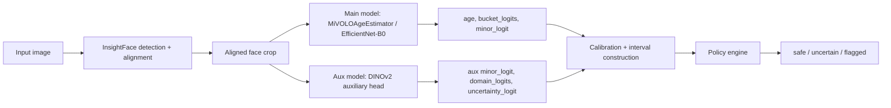
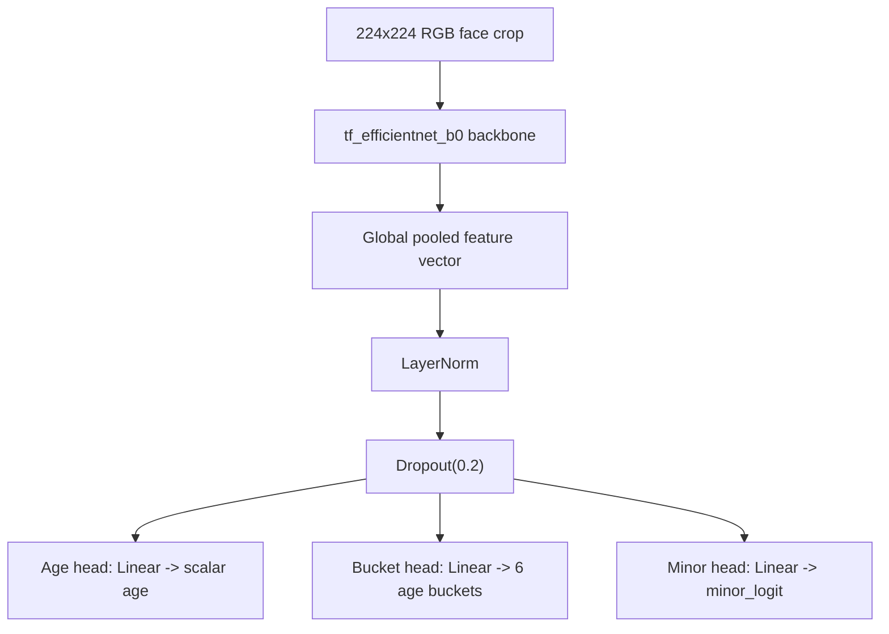
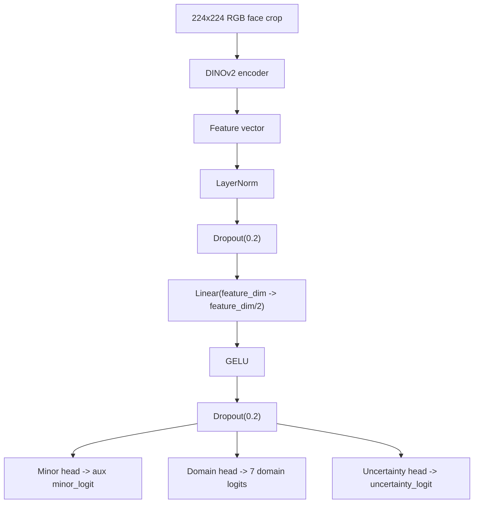
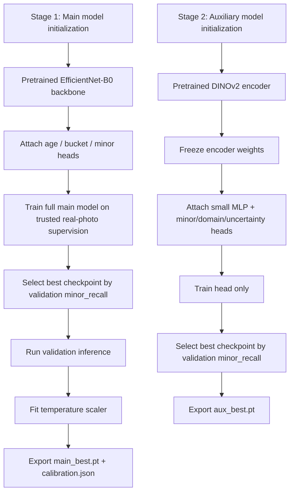

# Decisions

## Product policy

This project uses a three-way safety policy instead of a hard binary classifier:

- `safe`
- `flagged`
- `uncertain`

This is deliberate. In a safety-critical setting, the cost of a false negative is higher than the cost of abstaining. The system should only return `safe` when adult evidence is strong, quality is acceptable, and the signals are consistent.

## Dataset choices

The shipped checkpoint is trained on:

- [`FairFace`](https://github.com/joojs/fairface/) for the actual supervised baseline, held-out validation and test metrics, and demographic reporting.

Evaluated ablation, but not shipped:

- [`UTKFace`](https://susanqq.github.io/UTKFace/) for broader age coverage and a harder teenage slice, used only in the rejected `UTKFace + FairFace` comparison run.

Scaffolded but not used in the shipped metrics:

- [`APPA-REAL`](https://chalearnlap.cvc.uab.cat/dataset/26/description/) for future ambiguity-aware age supervision.
- [`SFHQ`](https://github.com/SelfishGene/SFHQ-dataset)
- [`SFHQ-T2I`](https://github.com/SelfishGene/SFHQ-T2I-dataset)
- [`Generated Photos Synthetic Face Images Academic Dataset`](https://huggingface.co/datasets/GeneratedPhotos/Synthetic_Face_Images_Academic_Dataset)
- [`Anime Face Dataset`](https://github.com/bchao1/Anime-Face-Dataset)
- [`DigiFace-1M`](https://microsoft.github.io/DigiFace1M/)
- `TrueFace`, when access and licensing are validated

The shipped robustness and abstention evaluation uses:

- [`DeepFakeFace`](https://github.com/OpenRL-Lab/DeepFakeFace)
- [`iCartoonFace`](https://github.com/luxiangju-PersonAI/iCartoonFace)
- held-out `FairFace` real-photo rows as the real reference domain

These non-real sources are intentionally not treated as the main source of exact age ground truth. Their role is to expose failure under domain shift and to justify conservative abstention.

For the current proof-of-concept run, the fastest reproducible trained baseline is `FairFace`. The pipeline already supports `UTKFace`, `APPA-REAL`, and the robustness datasets, but those are staged as the next iteration rather than being falsely claimed as already-trained sources.

On April 20, 2026, I also ran a `UTKFace + FairFace` ablation. That experiment improved precision but reduced minor recall and increased the false-negative rate in the dangerous `13-17` slice. Because this task is safety-critical, I rejected that checkpoint as the final shipped candidate and kept the `FairFace` baseline as the recommended deployment model.

How the shipped data is processed and verified:

- `prepare_fairface.py` normalizes the official FairFace CSVs into a single manifest schema with image path, demographic attributes, and age-derived targets.
- the ambiguous FairFace `10-19` label is explicitly downgraded from supervised training by setting `age_bucket=unknown`, `minor_label=None`, and `label_status=ambiguous`; that keeps the most legally sensitive ambiguous range out of the trusted supervised split instead of pretending it is a clean label
- `prepare_utkface.py` parses UTKFace filename metadata into explicit age, gender, and race fields for the ablation path
- `prepare_nonreal_eval.py` assigns non-real images to robustness-only manifests with `age_bucket=unknown` and `minor_label=None`, so synthetic/cartoon data is not silently treated as exact age ground truth
- `deduplicate.py` removes exact and simple perceptual duplicates using file MD5 plus average-hash checks
- `split_dataset.py` stratifies supervised rows by `domain_type x age_bucket` so train, validation, and test splits preserve the age structure that matters to safety

In other words, label-quality handling in this repo is conservative by design: ambiguous ranges are downgraded, non-real data is kept out of exact-age supervision, and the final shipped checkpoint only relies on the cleanest reproducible subset.

The exact bucket and label utilities live in [ml/training/utils.py](ml/training/utils.py), and the actual sample construction logic is in [ml/training/datasets/face_dataset.py](ml/training/datasets/face_dataset.py). That matters because the trusted-label story is not just prose: it is enforced in code.

## Model choices

Preferred architecture:

- [`InsightFace`](https://github.com/deepinsight/insightface) for detection and alignment.
- a custom `MiVOLOAgeEstimator` main model whose design is inspired by [`MiVOLO`](https://github.com/WildChlamydia/MiVOLO), but whose shipped checkpoint uses a `timm` `tf_efficientnet_b0` backbone with lightweight age, bucket, and minor-risk heads.
- [`DINOv2`](https://github.com/facebookresearch/dinov2) as the auxiliary domain-robust encoder.

The shipped architecture is intentionally not “detector -> classifier -> done.”

It is:

- face detection and aligned crop extraction with `InsightFace`
- primary age estimation and `p_minor` scoring with a `MiVOLO`-inspired head over `tf_efficientnet_b0`
- auxiliary domain and uncertainty scoring with `DINOv2`
- post-hoc temperature calibration of the main minor-risk score
- policy evaluation over age interval, conflict score, domain type, face confidence, face area, and quality flags

That extra policy layer is the main design choice of the system. It is what allows the final product to abstain under shift instead of pretending that every image belongs to the in-domain photographic distribution.

The codebase includes fallback implementations because model availability on first boot is often incomplete. That keeps the scaffold runnable on a pod before the final checkpoints are ready.

The production-oriented asset path is:

- optional MiVOLO V2 weights from Hugging Face for inference-time age estimation
- official DINOv2 loading via PyTorch Hub with an optional local repo clone
- InsightFace `buffalo_l` loaded from a local root to avoid unexpected runtime downloads on pods

Model internals in the shipped checkpoint:

- main model:
  - `timm.create_model("tf_efficientnet_b0", pretrained=True, num_classes=0, global_pool="avg")`
  - `LayerNorm`
  - `Dropout(0.2)`
  - three linear heads for scalar age regression, age-bucket classification, and binary minor-risk scoring
- auxiliary model:
  - `dinov2_vits14_reg` backbone loaded through PyTorch Hub
  - encoder frozen for the shipped run to keep training stable on a small dataset
  - lightweight MLP head: `LayerNorm -> Dropout -> Linear -> GELU -> Dropout`
  - three outputs: minor-risk logit, domain logits, and uncertainty logit

### Visual architecture

End-to-end inference path:

Main model graph, implemented in [ml/training/models/mivolo_wrapper.py](ml/training/models/mivolo_wrapper.py):

Auxiliary model graph, implemented in [ml/training/models/dinov2_head.py](ml/training/models/dinov2_head.py):

The diagrams above reflect the exact shipped code path. The main model is intentionally small and task-specific after the backbone. The auxiliary model is intentionally shallow after the encoder because its job is not precise age estimation; it is disagreement, domain, and uncertainty estimation.

This architecture was chosen because it separates two different jobs:

- the main model estimates age-like signals on real photographic faces
- the auxiliary model estimates whether the input looks off-distribution or unreliable

That separation is more defensible for a safety system than trying to make a single classifier solve age estimation, domain detection, and uncertainty all at once.

## Training strategy

The training pipeline is intentionally simple, auditable, and recall-first.

### Fine-tuning map

The shipped baseline is not a single end-to-end joint fine-tuning run. It is a staged fine-tuning process:

Operationally, the shipped fine-tuning choices are:

- main model:
  - pretrained backbone: yes
  - trainable backbone: yes
  - trainable heads: yes
  - objective: age regression + age buckets + minor-risk
- auxiliary model:
  - pretrained backbone: yes
  - trainable backbone: no
  - trainable head: yes
  - objective: minor-risk + domain classification + uncertainty

So the main model is fully fine-tuned, while the auxiliary model is only partially fine-tuned. That distinction is deliberate. The age-estimation task benefits from adapting the full feature extractor, but the auxiliary domain/uncertainty path is more stable when the strong pretrained DINOv2 encoder is frozen and only the lightweight head is adapted.

Main model strategy:

- image preprocessing:
  - resize to `224x224`
  - random horizontal flip during training
  - light color jitter during training
  - ImageNet normalization
- objective:
  - `0.4 * SmoothL1(age regression)`
  - `0.3 * cross_entropy(age bucket)`
  - `0.3 * BCEWithLogits(minor label)`
- hard-case weighting:
  - rows with ages in the `15-21` boundary band receive a `2x` weight
  - rows with additional quality flags are also upweighted so the model does not only optimize on clean easy faces
- optimizer and schedule:
  - `AdamW`
  - learning rate `3e-4`
  - weight decay `1e-4`
  - `6` epochs in the shipped config
  - gradient accumulation `2`
  - mixed precision on CUDA
- checkpoint selection:
  - choose the best checkpoint by validation `minor_recall`
  - break ties with lower validation loss

Mathematically, the main-model objective implemented in [ml/training/scripts/train_main.py](ml/training/scripts/train_main.py) is:

$$
\mathcal{L}_{\text{main}} =
0.4 \cdot \mathcal{L}_{\text{reg}}
+ 0.3 \cdot \mathcal{L}_{\text{bucket}}
+ 0.3 \cdot \mathcal{L}_{\text{minor}}
$$

where:

$$
\mathcal{L}_{\text{reg}} = \text{SmoothL1}(\hat a, a)
$$

$$
\mathcal{L}_{\text{bucket}} = \text{CrossEntropy}(\hat y_{\text{bucket}}, y_{\text{bucket}})
$$

$$
\mathcal{L}_{\text{minor}} = \text{BCEWithLogits}(\hat z_{\text{minor}}, y_{\text{minor}})
$$

and each term is reweighted by the sample weight constructed in [ml/training/datasets/face_dataset.py](ml/training/datasets/face_dataset.py):

$$
w_i = \max(1,\; w_{\text{boundary}} + 0.2 \cdot |\text{quality flags}_i|)
$$

with $w_{\text{boundary}} = 2.0$ for the `15-21` band and `1.0` otherwise.

Auxiliary model strategy:

- freeze the `DINOv2` backbone and train only the small head
- optimize a weighted multi-task objective:
  - `0.45 * BCEWithLogits(minor label)`
  - `0.35 * cross_entropy(domain class)`
  - `0.20 * BCEWithLogits(uncertainty target)`
- derive the uncertainty target from image quality: lower-quality rows receive higher uncertainty supervision
- again, select the exported checkpoint by validation `minor_recall`, with loss as the tie-breaker

The auxiliary-model objective in [ml/training/scripts/train_aux.py](ml/training/scripts/train_aux.py) is:

$$
\mathcal{L}_{\text{aux}} =
0.45 \cdot \mathcal{L}_{\text{minor}}
+ 0.35 \cdot \mathcal{L}_{\text{domain}}
+ 0.20 \cdot \mathcal{L}_{\text{uncertainty}}
$$

This is the core fine-tuning tradeoff of the shipped run:

- the main model is fully optimized for age and minor-risk on real-photo supervision
- the `DINOv2` auxiliary backbone is frozen, and only the small head is optimized
- this makes the auxiliary path more stable on a limited dataset and reduces the chance of overfitting the domain classifier to a narrow robustness pool

Calibration strategy:

- run full validation inference first
- fit a single temperature scaler on raw validation minor logits using `LBFGS`
- export `calibration.json`
- use the calibrated score for the policy engine rather than the raw logit

More concretely, [ml/training/scripts/calibrate.py](ml/training/scripts/calibrate.py) fits:

$$
p_{\text{minor}} = \sigma\left(\frac{z}{T}\right)
$$

with `LBFGS`, where $z$ is the raw `minor_logit` and $T$ is the learned scalar temperature. For the shipped checkpoint, the exported temperature is `1.1242778301239014`.

Why this training approach:

- it keeps the main age model focused on the in-domain real-photo problem
- it avoids pretending synthetic/cartoon images have clean legal-age labels
- it makes calibration and policy tuning tractable
- it optimizes directly for the failure mode that matters most here: missing minors

## Threshold decisions

Suggested defaults for the shipped baseline:

- `safe` if `p_minor < 0.05`, quality is acceptable, there is no strong model conflict, and the lower bound of the age interval is at least `20.0`
- `flagged` if `p_minor >= 0.40` or the age estimate is close to or below the legal boundary
- `uncertain` otherwise

Thresholds should be tuned on validation slices, not on global accuracy. The explicit tradeoff is to accept more abstention and more false positives in exchange for reducing dangerous misses on minors.

The `adult_safe_age_lower_bound` was originally set to `21.0`. On April 20, 2026, I reran the tracked reviewer sample set on a RunPod RTX 4090 and found that the `21.0` gate was too strict for real adults: only `2/10` adult-looking samples returned `safe`, despite most having very low `p_minor`, no quality flags, and solid face confidence. Lowering that gate to `20.0` changed the same reviewer set to `9/10` adult approvals while keeping the clearly weaker `adult_face_3` sample as `uncertain`.

That is a better operational tradeoff for this proof of concept. The adult-safe rule is still conservative, but it is no longer collapsing obvious adults into abstentions.

How to interpret the shipped metrics:

- `minor_recall` is the core safety metric for the binary classifier
- `minor_false_negative_rate` is its inverse framing and is easier to reason about operationally
- `minor_precision` matters, but is secondary to avoiding dangerous misses
- `roc_auc` and `pr_auc` show the score quality is high enough that policy tuning is meaningful
- `verdict_counts` are policy outcomes, not direct classifier outputs

In terms of confusion-matrix entries:

$$
\text{precision} = \frac{TP}{TP + FP}, \quad
\text{recall} = \frac{TP}{TP + FN}, \quad
F_1 = \frac{2TP}{2TP + FP + FN}
$$

and:

$$
\text{minor false negative rate} = \frac{FN}{TP + FN}
$$

Those exact quantities are computed in [ml/training/scripts/evaluate.py](ml/training/scripts/evaluate.py), which also exports:

- ROC AUC
- PR AUC
- reliability diagrams
- subgroup metrics
- failure-analysis CSVs
- split and robustness summaries

The `UTKFace` ablation made this tradeoff explicit: it improved `minor_precision` but worsened `minor_recall` and produced unsafe behavior in teenage slices unless the adult-safe gate was tightened so aggressively that `safe` throughput collapsed. That is the reason it remains an ablation rather than the final policy target.

## Evaluation harness

The evaluation harness is built to answer the specific questions in the brief, not just to produce a single score.

For each split, the repo saves:

- `*_predictions.csv` with per-image scores, intervals, conflicts, verdicts, and reasons
- `*_metrics.json` with headline metrics
- `*_slice_metrics.csv` for age/domain slices
- `*_subgroup_metrics.csv` for demographic slices
- reliability CSV/PNG outputs for calibration
- confusion matrices
- failure-analysis CSVs

That gives a reviewer enough evidence to inspect:

- binary safety metrics such as `minor_recall` and `minor_false_negative_rate`
- confidence calibration
- demographic behavior
- robustness behavior under domain shift
- concrete failure rows rather than only aggregate numbers

What the shipped results show:

- on held-out real-photo FairFace data, the model has strong score separation and high minor recall
- on robustness data, the system mostly abstains rather than returning `safe`
- the subgroup report is useful, but limited by the fact that shipped FairFace minors are concentrated in `0-12`

The shipped artifacts support that claim directly:

- [reports/metrics/test_metrics.json](reports/metrics/test_metrics.json): recall `0.9737`, ROC AUC `0.9959`, PR AUC `0.9855`
- [reports/metrics/val_metrics.json](reports/metrics/val_metrics.json): recall `0.9700`, ROC AUC `0.9953`, PR AUC `0.9845`
- [reports/metrics/robustness_metrics.json](reports/metrics/robustness_metrics.json): `125,647` `uncertain`, `4,407` `flagged`, `0` `safe`

Important limitation I would call out explicitly in review:

- the auxiliary domain head is not strong enough to perfectly classify AI/cartoon inputs by domain label
- the shipped robustness posture comes mostly from conservative safe-gating, conflict, and uncertainty handling, not from a perfect domain classifier
- on the current shipped policy, an AI-generated adult-looking face in the tracked reviewer set still returned `safe` because it was classified as `domain_type=real`

That limitation is acceptable for this proof of concept because the system abstains safely, but it is exactly the kind of thing I would strengthen before a real production rollout.

## Bias analysis

Bias is evaluated primarily with `FairFace`, because it offers demographic attributes that make subgroup reporting feasible. The intended analysis breaks metrics down by:

- age bucket
- gender
- race
- domain type
- image quality slice

Known constraints:

- demographic labels in public datasets are imperfect and should not be treated as identity truth
- the final shipped checkpoint is intentionally the `FairFace` baseline because the `UTKFace` ablation degraded recall in the most safety-sensitive slice
- bias results should be reported as measured behavior, not as proof that the system is fair enough for fully autonomous enforcement
- in the shipped `FairFace` test split, labeled minors appear in the `0-12` bucket only, so the subgroup report does not by itself validate borderline `13-17` behavior

Current shipped-checkpoint subgroup findings:

- gender:
  - `female` minor recall `0.9723`, minor false-negative rate `0.0277`
  - `male` minor recall `0.9748`, minor false-negative rate `0.0252`
- race:
  - highest false-negative rates in the shipped test split were `latino_hispanic` (`0.0450`) and `indian` (`0.0419`)
  - lowest false-negative rates were `southeast asian` (`0.0049`) and `east asian` (`0.0122`)

These are not large enough subgroup counts to justify aggressive threshold changes by themselves, but they are large enough to justify explicit disclosure and continued monitoring.

## Real vs generated images

The repository treats real and generated images as a first-class domain-shift problem.

The strategy is:

- use `FairFace` as the shipped supervised training and evaluation set
- use the rejected `UTKFace + FairFace` ablation to understand borderline-age tradeoffs before shipping
- use synthetic, anime, cartoon, 3D, and edited datasets for robustness evaluation and abstention testing
- prefer `uncertain` when the domain signal is unstable or the auxiliary model conflicts with the main model

This is deliberate. Synthetic and stylized datasets often do not provide reliable legal-age labels, so forcing them into the main supervision pool would make the model look broader while actually reducing trustworthiness.

That is also why the current generalization story is mostly operational rather than purely representational. The model generalizes well because:

- the trusted supervised core is clean
- the hardest boundary region is upweighted
- the minor-risk score is calibrated
- the auxiliary model provides disagreement and uncertainty signals
- the policy is allowed to abstain instead of over-claiming confidence

For the shipped baseline, the robustness split produced:

- `125,647` `uncertain`
- `4,407` `flagged`
- `0` `safe`

That should be read as a conservative abstention result, not as a claim that the model accurately estimates age on synthetic or cartoon images. In the shipped report, those robustness rows come primarily from `DeepFakeFace` and `iCartoonFace`, with held-out `FairFace` rows as the real-photo reference.

## Evaluation philosophy

The repository optimizes for:

- minor recall
- low minor false-negative rate
- calibrated risk scores
- slice-level reporting

Global accuracy is not the primary objective. The important analysis happens on:

- ages `16-21`
- low-quality images
- occlusion and blur
- profile views
- multi-face images
- real vs synthetic vs stylized content

## Integration design

Recommended platform integration:

User uploads a profile photo:

- make this a synchronous call
- accept only `safe`
- reject `flagged`
- ask for replacement or route to manual review on `uncertain`

User uploads 30 training photos:

- process this asynchronously as a batch job
- return per-image results plus a batch summary
- block model training if any image is `flagged`
- require cleanup or manual review if the batch has too many `uncertain` rows

GPU cluster finishes generating an image:

- screen the generated image before delivery to the user
- block on `flagged`
- hold, discard, or send to review on `uncertain` depending on product policy and latency budget

User publishes to a public gallery:

- run another check before publish instead of trusting an earlier result forever
- this catches policy changes, post-processing, or missed moderation on previously generated assets

Edge cases:

What happens when a photo is flagged:

- block the action that triggered the check
- ask for a different image
- escalate repeated or high-risk events to manual review or additional identity/account verification

What happens when no face is detected:

- return `uncertain`
- do not auto-approve a no-face image in a safety-sensitive workflow

What happens when there are multiple faces:

- evaluate every face
- use the highest-risk face verdict as the image verdict

How I would retrain or update the model:

- collect confirmed false positives, dangerous misses, repeated `uncertain` cases, and new domain-shift examples
- add stronger borderline-age review data around `16-21`
- rerun calibration and subgroup reporting before shipping a new checkpoint

## Production concerns

The design explicitly handles:

- no-face cases
- multiple faces
- domain drift
- low-confidence predictions
- monitoring and retraining loops

Future production improvements:

- stronger licensed hard-case collections
- domain-specific calibration
- provenance signals such as C2PA-aligned metadata
- active learning around repeated `uncertain` and confirmed review outcomes

## What I'd do with more time

The next highest-value improvements would be:

- revisit `UTKFace` with stronger label audit, sample reweighting, or a borderline-age curriculum before promoting it into the shipped baseline
- add `APPA-REAL` into the trained baseline and rerun calibration
- add at least one synthetic robustness dataset such as `SFHQ-T2I` or `DeepFakeFace` into evaluation
- build a stronger borderline-age audit slice around `16-21`
- run a tighter demographic report from the completed evaluation artifacts and use it to retune thresholds
- verify the full NestJS-to-Python inference path under `docker-compose` with the exported bundle that will be submitted
