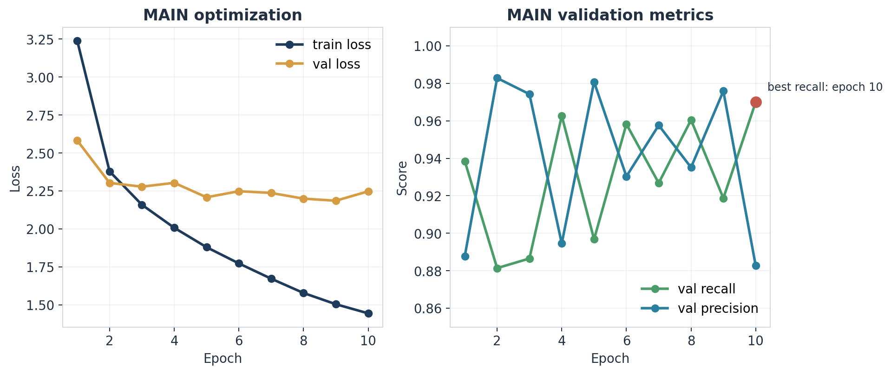
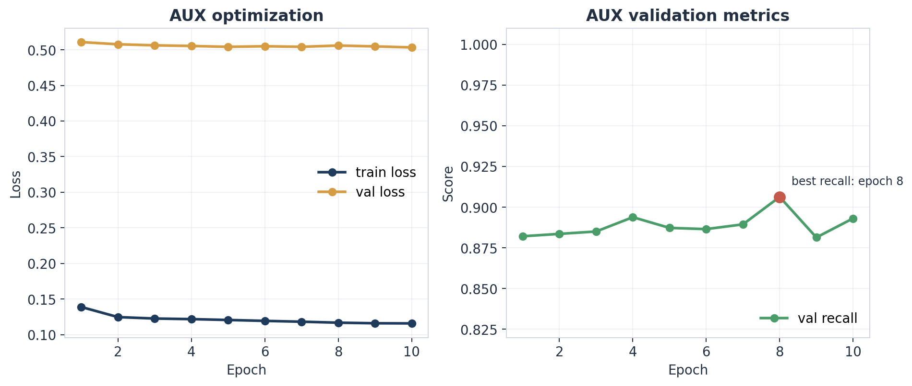
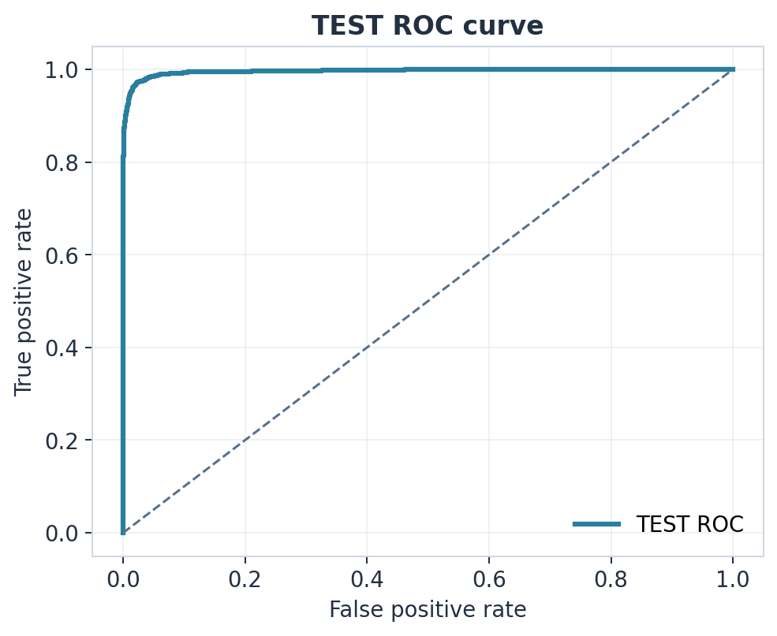
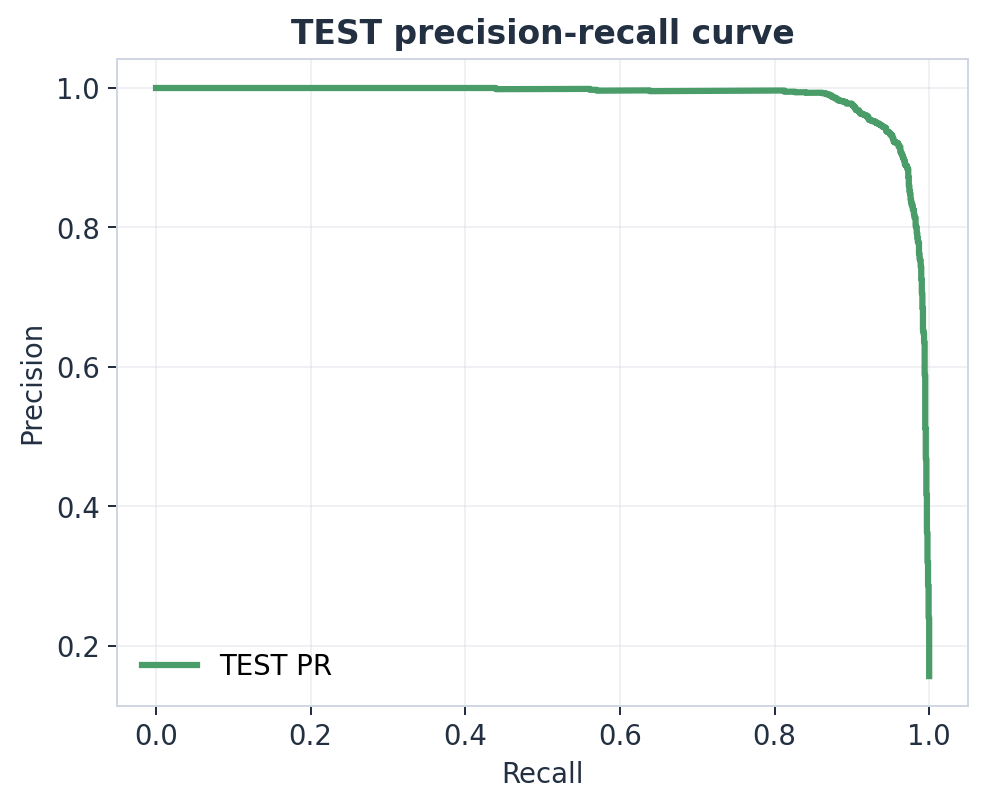
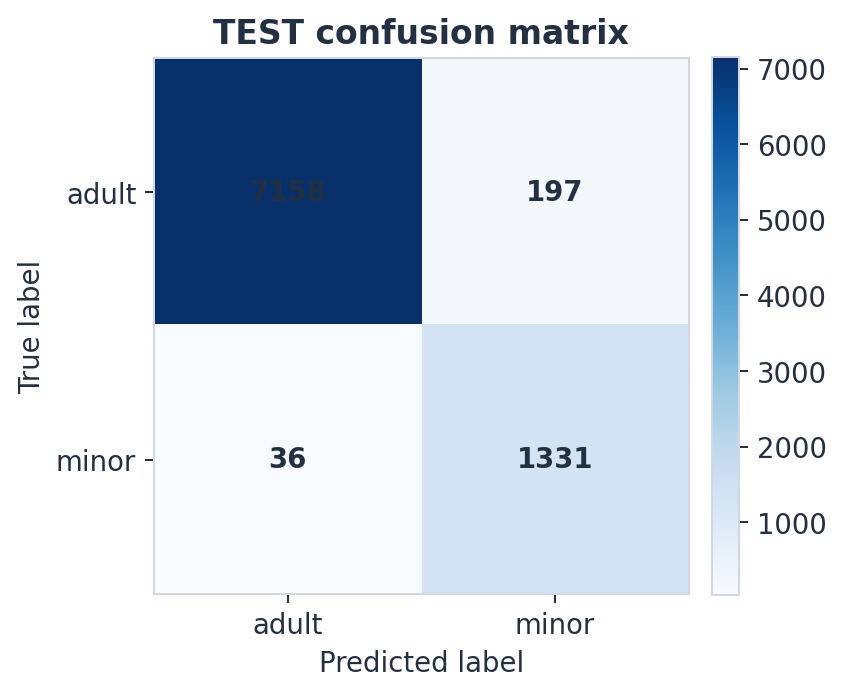
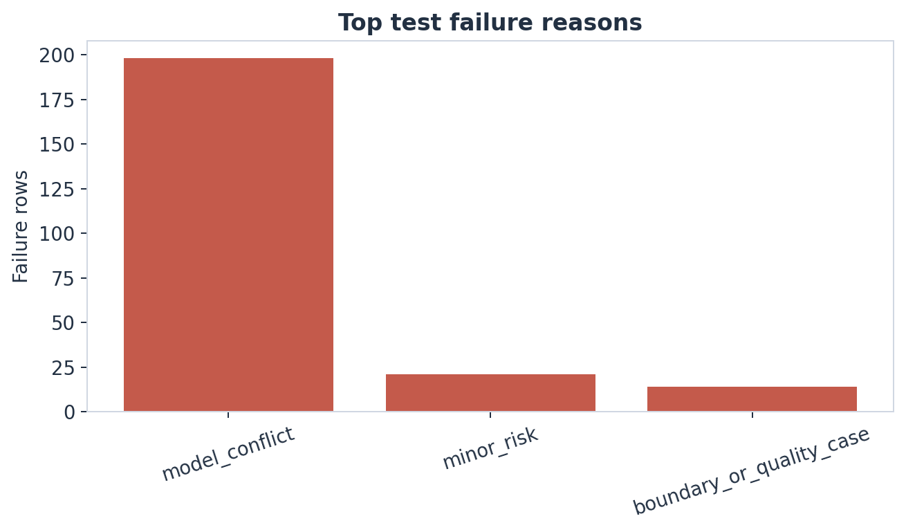
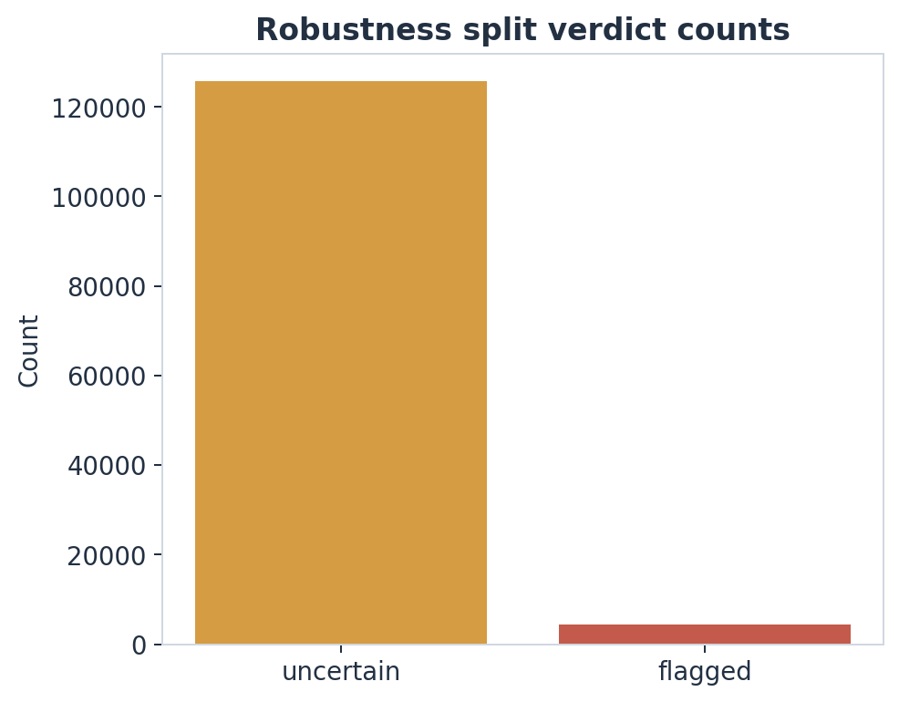

# Methods and Metrics

This document expands the short project summary in [README.md](README.md) with the exact mathematical definitions, training objectives, optimization details, and evaluation formulas used by the shipped baseline.

The purpose is to make the pipeline auditable: every number in the reports should map back to either a script, a config file, or an exported artifact in the repo.

## 1. Core prediction quantities

The primary model produces three outputs in [ml/training/models/mivolo_wrapper.py](ml/training/models/mivolo_wrapper.py):

- scalar age estimate `age`
- age-bucket logits `bucket_logits`
- binary minor-risk logit `minor_logit`

At evaluation and inference time, the shipped system converts the raw logit into a calibrated probability-like score:

$$
p_{\text{minor}} = \sigma\left(\frac{z}{T}\right)
$$

where:

- $z$ is the raw `minor_logit`
- $T$ is the learned temperature in [ml/training/outputs/exported/calibration.json](ml/training/outputs/exported/calibration.json)
- $\sigma(\cdot)$ is the logistic sigmoid

This is implemented in:

- [ml/training/scripts/calibrate.py](ml/training/scripts/calibrate.py)
- [ml/training/scripts/evaluate.py](ml/training/scripts/evaluate.py)
- [ml/inference/predictor.py](ml/inference/predictor.py)

For the shipped baseline:

- temperature: `1.1242778301239014`
- validation Brier score before calibration: `0.019597128033638`
- validation Brier score after calibration: `0.019377050921320915`

## 2. Auxiliary model signals

The auxiliary model in [ml/training/models/dinov2_head.py](ml/training/models/dinov2_head.py) predicts:

- an auxiliary minor-risk logit
- a domain-type logit vector over:
  - `real`
  - `ai_generated`
  - `cartoon`
  - `anime`
  - `three_d`
  - `edited`
  - `unknown`
- an uncertainty logit

Those outputs are converted into:

$$
\hat p_{\text{minor,aux}} = \sigma(z_{\text{aux}})
$$

$$
u = \sigma(z_{\text{uncertainty}})
$$

$$
c = \left|p_{\text{minor}} - \hat p_{\text{minor,aux}}\right|
$$

where:

- $u$ is the uncertainty score
- $c$ is the conflict score between the main and auxiliary models

## 3. Age interval construction

The system deliberately does not trust the raw age estimate as a point prediction for policy decisions.

Instead, [ml/training/scripts/evaluate.py](ml/training/scripts/evaluate.py) and [ml/inference/predictor.py](ml/inference/predictor.py) widen it into an interval:

$$
\text{spread} = 2.5 + 5u + 2c
$$

$$
\text{age\_interval} = \left[\max(0, \hat a - \text{spread}), \hat a + \text{spread}\right]
$$

where $\hat a$ is the model's scalar age estimate.

This is one of the key safety mechanisms in the repo: uncertainty and model disagreement directly widen the interval, which makes `safe` harder to reach when the model is unstable.

## 4. Face-level policy

The face-level policy is implemented in:

- [ml/inference/policy.py](ml/inference/policy.py)
- [ml/training/models/policy.py](ml/training/models/policy.py)
- shipped export: [ml/training/outputs/exported/policy.json](ml/training/outputs/exported/policy.json)

The shipped defaults are:

- `safe_threshold = 0.05`
- `flagged_threshold = 0.40`
- `adult_safe_age_lower_bound = 20.0`
- `minimum_face_confidence = 0.80`
- `low_face_area_threshold = 0.05`
- `max_conflict_score = 0.25`

The logic can be written as:

$$
\text{verdict} =
\begin{cases}
\texttt{uncertain}, & \text{if face confidence} < 0.80 \\
\texttt{uncertain}, & \text{if face area ratio} < 0.05 \\
\texttt{uncertain}, & \text{if conflict score} > 0.25 \\
\texttt{uncertain}, & \text{if predicted domain} \in \{\texttt{anime}, \texttt{cartoon}, \texttt{three\_d}\} \\
\texttt{flagged}, & \text{if } p_{\text{minor}} \ge 0.40 \text{ or } \text{age\_interval}_{\min} < 18 \\
\texttt{safe}, & \text{if } p_{\text{minor}} < 0.05 \land \text{age\_interval}_{\min} \ge 20 \land \text{quality flags} = \varnothing \\
\texttt{uncertain}, & \text{otherwise}
\end{cases}
$$

The image-level policy is the worst face in the image under the ordering:

$$
\texttt{safe} < \texttt{uncertain} < \texttt{flagged}
$$

## 5. Labeling and target construction

The age buckets are defined in [ml/training/utils.py](ml/training/utils.py):

- `0-12`
- `13-15`
- `16-17`
- `18-20`
- `21-25`
- `26+`

The shipped FairFace mapping is intentionally conservative:

- `0-2` and `3-9` map to `0-12`
- `10-19` is mapped to the visually dangerous teenage region for bucket semantics, but is downgraded during dataset preparation for trusted supervision
- `20-29` maps to `21-25`
- `30-39`, `40-49`, `50-59`, `60-69`, `70+` all map to `26+`

Important implementation detail:

- [ml/training/scripts/prepare_fairface.py](ml/training/scripts/prepare_fairface.py) downgrades ambiguous `10-19` rows by setting:
  - `age_bucket=unknown`
  - `minor_label=None`
  - `label_status=ambiguous`

That is why the shipped trusted supervised baseline does not pretend borderline `10-19` labels are clean legal-age targets.

## 6. Main-model objective

The main training loss is implemented in [ml/training/scripts/train_main.py](ml/training/scripts/train_main.py).

For a batch of samples, the total objective is:

$$
\mathcal{L}_{\text{main}} =
\lambda_{\text{age}} \mathcal{L}_{\text{reg}}
+ \lambda_{\text{bucket}} \mathcal{L}_{\text{bucket}}
+ \lambda_{\text{minor}} \mathcal{L}_{\text{minor}}
$$

with shipped weights:

- $\lambda_{\text{age}} = 0.4$
- $\lambda_{\text{bucket}} = 0.3$
- $\lambda_{\text{minor}} = 0.3$

More explicitly:

$$
\mathcal{L}_{\text{reg}} = \text{SmoothL1}(\hat a, a)
$$

$$
\mathcal{L}_{\text{bucket}} = \text{CrossEntropy}(\hat y_{\text{bucket}}, y_{\text{bucket}})
$$

$$
\mathcal{L}_{\text{minor}} = \text{BCEWithLogits}(\hat z_{\text{minor}}, y_{\text{minor}})
$$

Each per-sample loss is multiplied by a sample weight:

$$
w_i = \max\left(1,\; w_{\text{boundary}} + 0.2 \cdot |\text{quality flags}_i|\right)
$$

where:

- $w_{\text{boundary}} = 2.0$ if age is in the `15-21` band
- otherwise $w_{\text{boundary}} = 1.0$

This weighting comes from [ml/training/datasets/face_dataset.py](ml/training/datasets/face_dataset.py).

## 7. Auxiliary-model objective

The auxiliary model is trained in [ml/training/scripts/train_aux.py](ml/training/scripts/train_aux.py).

Its objective is:

$$
\mathcal{L}_{\text{aux}} =
0.45 \cdot \mathcal{L}_{\text{minor}}
+ 0.35 \cdot \mathcal{L}_{\text{domain}}
+ 0.20 \cdot \mathcal{L}_{\text{uncertainty}}
$$

where:

$$
\mathcal{L}_{\text{minor}} = \text{BCEWithLogits}(\hat z_{\text{minor,aux}}, y_{\text{minor}})
$$

$$
\mathcal{L}_{\text{domain}} = \text{CrossEntropy}(\hat y_{\text{domain}}, y_{\text{domain}})
$$

$$
\mathcal{L}_{\text{uncertainty}} = \text{BCEWithLogits}(\hat z_{\text{uncertainty}}, 1 - q)
$$

and $q$ is the quality score derived from quality tags in [ml/training/datasets/face_dataset.py](ml/training/datasets/face_dataset.py).

The DINOv2 encoder is frozen in the shipped run:

- `freeze_encoder = true` in [ml/training/configs/base.yaml](ml/training/configs/base.yaml)

So the fine-tuning process here is intentionally shallow and stable:

- the backbone provides strong generic features
- only the lightweight head is optimized for minor-risk, domain, and uncertainty supervision

## 8. Optimization details

The shipped hyperparameters live in [ml/training/configs/base.yaml](ml/training/configs/base.yaml):

- seed: `42`
- image size: `224`
- train batch size: `16`
- eval batch size: `32`
- main optimizer: `AdamW`
- learning rate: `3e-4`
- weight decay: `1e-4`
- epochs: `6`
- gradient accumulation: `2`
- mixed precision: enabled on CUDA

Checkpoint selection is recall-first:

- the best checkpoint is chosen by validation `minor_recall`
- validation loss is only a tie-breaker

This is implemented in both:

- [ml/training/scripts/train_main.py](ml/training/scripts/train_main.py)
- [ml/training/scripts/train_aux.py](ml/training/scripts/train_aux.py)

### Optimization history figures

The training scripts write per-epoch JSON logs to:

- [ml/training/outputs/history/main_history.json](ml/training/outputs/history/main_history.json)
- [ml/training/outputs/history/aux_history.json](ml/training/outputs/history/aux_history.json)

The recovered history in this repo corresponds to the RunPod 4090 training configuration in [ml/training/configs/runpod_4090.yaml](ml/training/configs/runpod_4090.yaml), which overrides the base config to train for `10` epochs instead of `6`.

The main-model plot below is the clearest picture of the optimization tradeoff. Training loss falls steadily, validation loss moves in a narrower and noisier band, and validation recall remains high enough that the final epoch is still the best export candidate. That behavior is consistent with a recall-first training target on a relatively small, curated supervised slice: the model keeps learning useful boundary information even when the validation loss is no longer monotonically improving.

The auxiliary-model plot is intentionally calmer. Because the DINOv2 encoder is frozen and only the lightweight head is updated, the optimization does not roam as aggressively as the main model. The best auxiliary recall arrives before the final epoch, which is exactly why the training script tracks validation recall directly and exports the best checkpoint rather than blindly taking the last one.

## 9. Metric definitions

For the binary minor-risk framing:

- `TP`: predicted minor and truly minor
- `FP`: predicted minor but truly adult
- `FN`: predicted adult but truly minor
- `TN`: predicted adult and truly adult

The repo reports:

$$
\text{precision} = \frac{TP}{TP + FP}
$$

$$
\text{recall} = \frac{TP}{TP + FN}
$$

$$
F_1 = \frac{2TP}{2TP + FP + FN}
$$

$$
\text{false negative rate} = \frac{FN}{TP + FN}
$$

Interpretation in this repository:

- `precision` tells us how often a "minor" prediction is justified. This is mostly a throughput and reviewer-burden question.
- `recall` tells us how often the system catches minors. This is the main safety question.
- `F1` gives a compact summary of both, but it is not the primary product objective because it weights misses and false alarms more evenly than the moderation problem does.
- `false negative rate` is the operational danger statistic: the share of minors still missed by the binary classifier.
- `ROC AUC` measures whether the raw score ranks minors above adults well across thresholds.
- `PR AUC` measures the same ranking quality with explicit focus on the positive class, which is usually more informative than accuracy in this task.
- `accuracy` is intentionally not the headline metric because class balance can make it look flattering while still hiding unsafe minor misses.

The implementation lives in [ml/training/scripts/evaluate.py](ml/training/scripts/evaluate.py), which also computes:

- ROC AUC
- PR AUC
- reliability curves
- confusion matrices
- subgroup metrics by age bucket, gender, and race

## 10. Shipped results snapshot

From:

- [reports/metrics/val_metrics.json](reports/metrics/val_metrics.json)
- [reports/metrics/test_metrics.json](reports/metrics/test_metrics.json)

### Validation

- row count: `8,717`
- precision: `0.8827`
- recall: `0.9700`
- F1: `0.9243`
- ROC AUC: `0.9953`
- PR AUC: `0.9845`
- false negative rate: `0.0300`

Interpretation: on validation, the shipped classifier already catches almost all minors, and only about three percent of minors remain missed at the binary threshold. That makes the policy-tuning stage worth doing, because it starts from a high-recall score rather than trying to rescue a weak classifier.

### Test

- row count: `8,722`
- precision: `0.8711`
- recall: `0.9737`
- F1: `0.9195`
- ROC AUC: `0.9959`
- PR AUC: `0.9855`
- false negative rate: `0.0263`

Interpretation: the test split is slightly better than validation on recall and false negative rate, which suggests the shipped baseline is not leaning on a fragile validation-only artifact. The main safety takeaway is that the held-out real-photo miss rate stays low.

### Test ROC curve

The ROC curve shows that the raw minor-risk score separates minors from adults cleanly before the policy layer adds abstention logic. Its near-top-left shape and very high AUC mean that the model usually assigns larger scores to minors than to adults across a wide range of possible thresholds. In this repository that matters because calibration and policy tuning only help if the underlying ranking is already strong; otherwise, changing thresholds would just reshuffle bad scores rather than refine a reliable signal.

### Test precision-recall curve

The precision-recall curve is the more decision-relevant plot for this problem because the positive class is "minor." It tells us how aggressively the system can chase minor recall before adult false alarms become excessive. The strong area under this curve means the model can keep recall high without precision collapsing, which is exactly the regime needed for a conservative moderation aid: catch most minors first, then let policy decide where to abstain rather than pretending the classifier alone solves the whole deployment problem.

The confusion matrices in:

- [reports/confusion_matrices/val_confusion_matrix.json](reports/confusion_matrices/val_confusion_matrix.json)
- [reports/confusion_matrices/test_confusion_matrix.json](reports/confusion_matrices/test_confusion_matrix.json)

correspond to:

### Validation confusion matrix

$$
\begin{bmatrix}
7175 & 176 \\
41 & 1325
\end{bmatrix}
$$

The `41` in the bottom-left position are the validation minors that the binary classifier still missed. That cell is the one that matters most in this repository because it maps directly to dangerous false negatives. The rest of the matrix matters too, but primarily as the price paid to keep that miss count low enough for a safety-first operating point.

### Test confusion matrix

$$
\begin{bmatrix}
7158 & 197 \\
36 & 1331
\end{bmatrix}
$$

The `36` in the bottom-left position are the held-out test minors that slipped through. The fact that this number stays low while the classifier still recovers a large number of true minors in the bottom-right cell is the main reason the `FairFace` baseline remained the shipped candidate. In other words, the matrix supports the same decision as the scalar metrics: this checkpoint is not perfect, but it is conservative in the direction that matters most.

The failure-reason chart adds one more layer of interpretation. The important observation is that many residual bad rows are not cleanly wrong `safe` decisions; they are rows pushed into abstention because of model conflict or boundary ambiguity. That is a much better residual failure mode for a moderation aid than quiet adult approvals on minors.

## 11. Robustness interpretation

The robustness split is intentionally not scored as ordinary supervised age classification, because those rows are not trusted exact-age labels.

Instead, the important questions are:

1. Does the system avoid returning `safe` under domain shift?
2. Does it surface abstention reasons that make operational sense?

From [reports/metrics/robustness_metrics.json](reports/metrics/robustness_metrics.json):

- total rows: `130,054`
- `uncertain`: `125,647`
- `flagged`: `4,407`
- `safe`: `0`

This is evidence of conservative abstention, not evidence that the system can estimate exact legal age on non-real domains.

This chart should not be read as ordinary supervised accuracy because the robustness split is intentionally full of domain-shifted rows where exact legal-age supervision is not trusted enough to support standard classification scoring. The important behavior is that the policy almost never emits `safe` under shift and instead pushes most rows into `uncertain`. That is the desired outcome here: when the input is synthetic, stylized, edited, or otherwise out of distribution, the system should abstain rather than convert weak evidence into false confidence.

## 12. Why the shipped baseline generalizes as well as it does

The current generalization story is not “the model learned every domain.” It is more conservative and more defensible:

1. The supervised core problem is clean:
   - trusted real-photo supervision comes from `FairFace`
   - ambiguous and synthetic rows are kept out of trusted exact-age supervision
2. The model is regularized structurally:
   - a pretrained EfficientNet backbone for the main model
   - a pretrained frozen DINOv2 encoder for auxiliary cues
3. Hard cases are upweighted:
   - the `15-21` boundary region gets extra weight
   - quality-tagged samples get extra weight
4. Post-hoc calibration reduces overconfident raw logits
5. The policy layer is allowed to abstain under:
   - low confidence
   - small faces
   - main/aux disagreement
   - stylized domain cues

In short, the system generalizes better operationally than a plain classifier because it is allowed to say “I do not know.”
